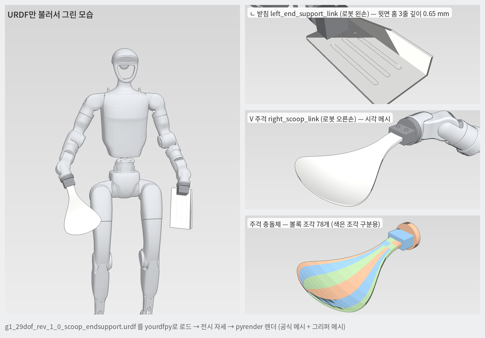

# G1 커스텀 그리퍼 URDF 패키지 (V 주걱 + ㄴ 끝단 받침)

Unitree 공식 `g1_29dof_rev_1_0.urdf`(unitree_ros `robots/g1_description`, commit ccfc6fd, 2026-09-16)의 더미손(rubber hand)을 빼고, 같은 자리(손목 플랜지면)에 커스텀 그리퍼 두 개를 붙인 URDF다. 로봇 본체의 관절·링크·메시·관성은 원본 그대로다.



## 1. 들어 있는 것

| 파일 | 내용 |
|---|---|
| `g1_29dof_rev_1_0_scoop_endsupport.urdf` | 완성 URDF (29 구동 관절, 원본과 동일) |
| `meshes/` | 공식 G1 메시 33개(더미손 2개 제외) + 그리퍼 메시(시각 4개, 충돌 79개) |
| `gripper_links_snippet.urdf.xml` | 그리퍼 링크·관절만 떼어 낸 조각 (다른 G1 URDF에 붙일 때) |
| `build_report.json` | 생성 조건과 링크별 질량·무게중심·TCP·부피 |
| `validate_log.txt` | 아래 5번 검증을 실제로 돌린 출력 |
| `tools/make_gripper_urdf.py` | 생성기 (치수·홈 깊이·재질·좌우를 바꿔 다시 만들 때) |
| `tools/validate.py`, `tools/preview.py` | 검증 스크립트, 미리보기 렌더 스크립트 |
| `LICENSE_unitree_ros` | 원본 라이선스 (BSD 3-Clause). 재배포할 때 이 파일을 같이 둘 것 |

## 2. 원본 대비 바뀐 점 (이것 말고는 원본과 같음)

1. `left_rubber_hand`·`right_rubber_hand` 링크와 `*_hand_palm_joint` 관절을 삭제했다.
2. 그 자리에 아래 링크·관절을 넣었다. 부착점은 공식 손 부착점과 같은 `*_wrist_yaw_link` 기준 x = 41.5 mm(손목 yaw 메시 앞면)이다.
   - `right_scoop_joint`(fixed) → `right_scoop_link` → `right_scoop_tcp_joint`(fixed) → `right_scoop_tcp`
   - `left_end_support_joint`(fixed) → `left_end_support_link` → `left_end_support_tcp_joint`(fixed) → `left_end_support_tcp`
   - 1차 안쪽 장착 시안: 원본 URDF의 왼 받침은 장착부 X축 기준 +90°, 오른 주걱은 −90° 회전한다. 윗면 법선이 각각 로봇 중심선 쪽(왼쪽 −Y, 오른쪽 +Y)을 향한다. 모션 편집기의 좌우 교환 모델에서는 왼 주걱 −Y, 오른 받침 +Y가 된다.
3. 재질 2개를 추가했다: `gripper_white`, `adapter_dark`.
4. `<mujoco><compiler …>`에 `strippath="true"`를 추가했다. 원본 파일은 MuJoCo 3.13에서 메시 경로가 `meshes/meshes/…`로 두 번 붙어 로드에 실패한다(여기서 직접 확인함). 이 한 줄로 해결된다.
5. 로봇 이름 뒤에 `_scoop_endsupport`를 붙였다.

좌우 배치는 참고 그림(화면 왼쪽 = 주걱)을 따라 **주걱 = 로봇 오른손, ㄴ 받침 = 로봇 왼손**이다. 반대로 하려면 7번의 `--scoop-side left`로 다시 만들면 된다. ㄴ 받침의 옆벽은 어느 손에 달든 몸 바깥쪽에 온다.

## 3. 그리퍼 형상 (링크 좌표계 기준)

두 링크 모두 원점은 플랜지면 중심이다. 링크 로컬 좌표에서 x = 그리퍼가 뻗는 방향, z = 윗면 법선이다. 손목 장착부에서 X축으로 90° 회전하므로 로봇 기본 자세에서 윗면은 위쪽이 아니라 몸 안쪽을 향한다.

**V 주걱 `right_scoop_link`**
- 위에서 보면 밥주걱 모양이다. 목 폭 32 mm에서 최대 폭 160 mm까지 넓어지고, 끝은 둥글다. 플랜지면에서 끝까지 248 mm다.
- 옆에서 보면 완만한 V다. 목에서 42 mm 내려갔다가 끝에서 24 mm 다시 올라온다.
- 앞에서 보면 얕은 접시다. 폭 방향 가장자리가 약 11.5 mm 올라온다.
- 두께는 목 8 mm에서 끝 3 mm까지 얇아진다.
- 어댑터는 원판 Ø58×12 mm + 클램프 블록 30×44×24 mm + 볼트머리 2개다.

**ㄴ 끝단 받침 `left_end_support_link`**
- 평판 180×90×4 mm, 모서리 R5.
- 윗면 홈 3줄: y = −22 / 0 / +22 mm 위치에 길이 100 mm(끝은 반원), 폭 7 mm, **깊이 0.65 mm**다. 관통이 아니라 윗면만 판 홈이고, 실측 깊이는 0.650 mm다.
- 옆벽: 몸 바깥쪽(+y) 가장자리에 두께 4 mm다. 판 바닥 기준 높이는 뿌리 12 mm에서 x = 118.5 mm까지 올라가 36 mm가 되고, 거기서 끝까지 36 mm로 유지된다(참고 그림의 30–40 mm 범위).
- 어댑터는 원판 Ø58×12 mm + 블록 30×44×44 mm + 볼트머리 2개다.

**TCP 프레임** (방향은 링크와 같고, z가 위)

| 프레임 | 링크 기준 위치 | 손목 yaw 링크 기준 | 의미 |
|---|---|---|---|
| `right_scoop_tcp` | (180.3, 0, −38.1) mm | (221.8, −38.1, 0) mm | 주걱 오목면 최저점 (묶음이 앉는 곳) |
| `left_end_support_tcp` | (180.3, 0, −38.1) mm | (221.8, +38.1, 0) mm | 시뮬레이션에서 좌우를 바꾼 뒤 왼 주걱 TCP와 대칭이 되는 제어점 |

TCP는 제어 기준점이다. 받침의 판과 옆벽 형상 및 충돌체는 옮기지 않았다. 모션 편집기의
`g1-tools` 로더는 두 도구를 좌우 교환하므로 실제 모델에서는 왼 주걱과 오른 받침의 TCP가
손목 기준 같은 전후·높이에 놓이고 좌우로 대칭이 된다. 에디터의 손 자세 목표는 회전된 툴 TCP 좌표계를 사용한다.
`validate_log.txt`는 공급된 원본 패키지의 검증 기록이며 TCP 보정 전 좌표를 담고 있다.

## 4. 질량·관성

질량·관성은 메시 부피에 밀도를 곱해서 계산했다. 본체 기본값은 **알루미늄 6061(2.70 g/cm³)**, 어댑터도 알루미늄이다. 관성은 무게중심 기준 전체 텐서이고, 양의 정부호와 삼각부등식을 확인했다.

| 링크 | 알루미늄(기본) | 본체만 PLA(1.24)로 바꾸면 | 원래 더미손 |
|---|---|---|---|
| `right_scoop_link` | 0.416 kg, 무게중심 (100.4, 0, −16.2) mm | 약 0.284 kg | 0.170 kg |
| `left_end_support_link` | 0.462 kg, 무게중심 (60.3, 4.5, −16.3) mm | 약 0.344 kg | 0.170 kg |

로봇 총질량은 29.527 kg에서 30.066 kg이 된다(+0.539 kg, MuJoCo 계산). 실제로 만들 재질이 정해지면 7번 방법으로 밀도만 바꿔 다시 만들면 된다.

## 5. 충돌체

- **주걱:** 볼록 조각 78개로 나눠 넣었다. MuJoCo와 Isaac은 메시 하나를 볼록 껍질 하나로 바꾸는데, 주걱을 통째로 넣으면 오목한 접시가 메워져서 묶음이 얹히지 않는다. 그래서 조각을 미리 잘게 나눴다.
  - 곡률이 큰 둥근 끝과 폭 가장자리에 조각을 몰아 배치했다.
  - 시각 메시 대비 오차: 윗면 최대 1.24 mm(평균 0.42), 아랫면 최대 0.21 mm, 덮는 비율 100%. 3202점에 위에서·아래서 광선을 쏴서 잰 값이다.
  - 어댑터는 원기둥 + 박스 기본도형이다.
- **ㄴ 받침:** 판은 박스 기본도형, 옆벽은 볼록 메시 1개, 어댑터는 원기둥 + 박스다.
  - **0.65 mm 홈은 충돌체에 넣지 않았다.** 이 크기는 시뮬 접촉에 의미가 없고, 넣으면 조각만 늘어난다.

## 6. 검증 결과 (`validate_log.txt` 원문 요약)

| 검사 | 결과 |
|---|---|
| ROS `check_urdf` (liburdfdom) | "Successfully Parsed XML" |
| yourdfpy | 로드·`validate()` 통과, 구동 관절 29개, 더미손 링크 없음 |
| MuJoCo 3.13 | 컴파일·순방향 계산 통과 (body 30, geom 157, mesh 116) |
| TCP 위치 | 위 표와 일치 |
| 주걱 충돌체 오차 | 기준 1.5 mm 이내 |
| 홈 깊이 실측 | 0.650 mm |
| 최종 | ALL PASS |

## 7. 사용법

팀 규칙대로 **본인 폴더와 그 안의 venv에서만** 작업한다. 공용 서버·노트북의 기존 conda env와 팀 파일은 건드리지 않는다. 아래 경로는 노트북 기준 예시다(서버면 `~/eunsu/container_6d`).

### 7-1. 풀기
- **무엇을:** 압축을 본인 폴더에 푼다.
  ```bash
  mkdir -p ~/container_6d/assets && cd ~/container_6d/assets
  unzip ~/다운로드/g1_scoop_endsupport_urdf.zip
  ls g1_scoop_endsupport
  ```
- **볼 것:** `g1_29dof_rev_1_0_scoop_endsupport.urdf`와 `meshes/`가 같은 폴더에 있어야 한다.
- **왜:** URDF 안의 메시 경로가 `meshes/…` 상대경로라서, 둘이 떨어지면 메시를 못 찾는다.

### 7-2. MuJoCo로 바로 열어보기 (가장 빠른 확인)
- **무엇을:** 본인 폴더에 전용 venv를 만들고 MuJoCo 뷰어로 URDF를 연다.
  ```bash
  cd ~/container_6d && python3 -m venv .venv_urdf && source .venv_urdf/bin/activate
  python -m pip install mujoco
  python -m mujoco.viewer --mjcf=$HOME/container_6d/assets/g1_scoop_endsupport/g1_29dof_rev_1_0_scoop_endsupport.urdf
  ```
- **화면에서 볼 것:** 두 손목 끝에 흰 주걱(오른손)과 슬롯 판(왼손)이 달린 G1이 보인다. 제어기가 없어서 시작하자마자 쓰러지는 게 정상이다. 창이 뜨면 바로 스페이스바로 일시정지하고 보면 된다.
- **확인할 것:** 그리퍼가 손목 앞면에 딱 붙어 있는지, 좌우가 맞는지.
- **안 될 때:**
  - `Error opening file …STL`이 나오면 `meshes/` 폴더가 URDF 옆에 있는지 확인한다.
  - 원본 URDF로도 같은 오류가 나는 건 2-4번의 원본 경로 문제라 정상이다.

### 7-3. 검증 다시 돌려보기 (선택)
- **무엇을:** 7-2의 venv에서 검증 스크립트를 돌린다.
  ```bash
  python -m pip install trimesh yourdfpy rtree
  python ~/container_6d/assets/g1_scoop_endsupport/tools/validate.py ~/container_6d/assets/g1_scoop_endsupport
  ```
- **볼 것:** 마지막 줄 `결과: ALL PASS`.
- **안 될 때:** 원본 대비 질량 비교는 두 번째 인자로 공식 `g1_description` 폴더를 줄 때만 나온다. 없으면 그 줄만 생략된다.

### 7-4. Isaac Sim / Isaac Lab
- **무엇을:** URDF 변환 설정을 이렇게 잡는다.
  - 충돌체 종류는 **convex hull**로 둔다. 조각이 이미 볼록이라 분해가 필요 없다. convex decomposition은 예전에 초기 관통 폭발을 일으킨 적이 있으니 쓰지 않는다.
  - TCP 프레임을 살리려면 **fixed joint 병합(merge fixed joints)을 끈다**. 켜면 그리퍼가 손목 링크에 합쳐지고 TCP 프림이 사라진다.
- **확인할 것:** 변환된 USD에 `right_scoop_link`·`left_end_support_link`가 있는지, 충돌 조각이 주걱 모양을 따라가는지. Physics 디버그 표시로 확인한다.
- **주의:** 옵션 이름은 Isaac Sim / Isaac Lab 버전마다 조금 다르다. Isaac Lab이면 쓰는 버전의 `UrdfConverterCfg` 정의에서 충돌체 종류·fixed joint 병합 항목 이름을 한 번 확인할 것.

### 7-5. IK·FK에서 TCP 쓰기 (pinocchio 예시)
```python
import pinocchio as pin
model = pin.buildModelFromUrdf("g1_29dof_rev_1_0_scoop_endsupport.urdf")
data = model.createData()
fid = model.getFrameId("right_scoop_tcp")          # 또는 "left_end_support_tcp"
q = pin.neutral(model); pin.framesForwardKinematics(model, data, q)
print(data.oMf[fid])                                # pelvis 기준 TCP 자세
```

### 7-6. 다른 G1 URDF에 붙이기 (예: 텔레옵 IK가 쓰는 hand14 계열)
- **무엇을:**
  1. 대상 URDF에서 기존 손 링크·관절(손목 yaw 링크 아래 전부)을 지운다.
  2. `gripper_links_snippet.urdf.xml` 내용을 `<robot>` 안에 붙인다(재질 2개 포함).
  3. 그리퍼 메시를 대상의 `meshes/`에 복사한다.
- **주의:** 손 관절 이름을 참조하는 코드가 있으면 같이 고쳐야 한다(예: IK에서 손 관절을 잠그는 목록). 원본 파일은 건드리지 말고 복사본에서 할 것.

## 8. 치수·홈 깊이·재질·좌우 바꿔서 다시 만들기

```bash
source ~/container_6d/.venv_urdf/bin/activate
python -m pip install numpy scipy trimesh shapely lxml manifold3d yourdfpy mujoco rtree
git clone --depth 1 https://github.com/unitreerobotics/unitree_ros.git ~/container_6d/third_party/unitree_ros
cd ~/container_6d/assets/g1_scoop_endsupport/tools
python make_gripper_urdf.py --src ~/container_6d/third_party/unitree_ros/robots/g1_description \
    --out ~/container_6d/assets/g1_gripper_v2 --groove-depth-mm 0.8 --body-density 1240
python validate.py ~/container_6d/assets/g1_gripper_v2 ~/container_6d/third_party/unitree_ros/robots/g1_description
```

| 옵션 | 기본값 | 뜻 |
|---|---|---|
| `--groove-depth-mm` | 0.65 | 홈 깊이 (0.3–2.0 허용) |
| `--groove-width-mm` | 7 | 홈 폭 |
| `--body-density` | 2700 | 그리퍼 본체 밀도 kg/m³ (알루미늄 2700, PLA 약 1240) |
| `--adapter-density` | 2700 | 어댑터 밀도 |
| `--scoop-side` | right | 주걱을 달 손. ㄴ 받침은 반대 손 |

주걱 곡선·폭·옆벽 높이 같은 형상값은 스크립트 위쪽 상수에 모여 있다(`FZ`, `hw`, `DISH`, `WALL_H` 등).

## 9. 한계 (솔직하게)

- **치수:** 전부 참고 그림 비율을 읽어 정한 예시다. 강도·처짐·파지 성능은 검증하지 않았다. 특히 주걱 끝 두께 3 mm는 재질에 따라 약할 수 있다.
- **어댑터:** 형상은 일반형이다. **실제 G1 손목 플랜지의 볼트 패턴·체결 치수는 반영하지 않았다.** 제작 전에 실물 플랜지 도면이나 실측으로 바꿔야 한다.
- **질량:** 가정한 밀도로 계산한 값이다. 실제 부품은 재질·충전률에 따라 달라진다.
- **홈:** 시각 메시에만 있고 충돌체에는 없다.
- **TCP:** 기하 기준점일 뿐이고, 실제 접촉점은 자세에 따라 달라진다.
